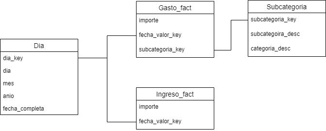

# Source code structure
- **doc**: documentation
- **etl**: etl processes
- **jupyter**: notebooks
- **db**: database 


# ETL
## RUN

- Run ```run.bat``` to process movements on file ```etl/in/Movements.xls``` and load DWH

## Extra - Load in parts
			   
- Run ```etl/gastos.ktr``` to load new Movements onto staging area

- Run ```etl/main.kjb``` after loading new movements ins taging to update public analysis model

# Dimensional model
- File ```doc/dimensional.drawio```



# Backup de los ficheros de movimeintos
etl\in_todos

# Notebook
### Installation
1. Run CMD
2. Navigate to **jupyter** folder
3. Run ```python -m venv gastos_env```
4. Run ```gastos_env/Scripts/activate```
5. @**jupyter** folder, run ```pip install -r requirements.txt```

### Run
1. Run CMD
2. Navigate to **jupyter** folder
3. Run ```gastos_env/Scripts/activate```
4. Run ```jupyter notebook```


# WIP

- TODO: Load new movements by script
