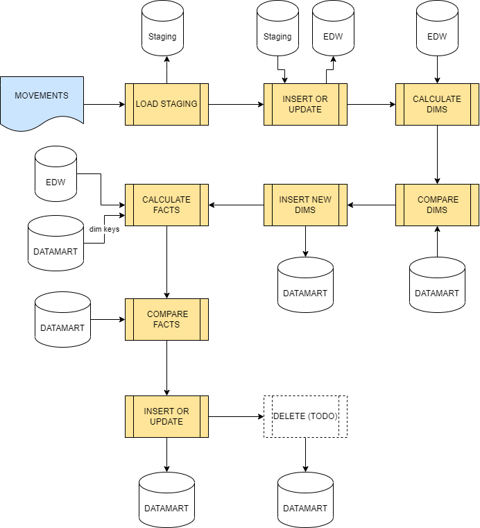

# Source code structure

- **etl**: etl processes
- **doc**: documentation
- **jupyter**: notebooks
- **db**: database 

# ETL

## Design

The ETL is design based on DELTA data from operational. No elements are deleted from EDW nor DTM.

The ETL Process is done in three steps:

1. Load Staging: load new movements (DELTA) on staging area
2. Load Enterprise DWH (edw): repository of historic information. E/R model. Movements from staging area
are inserted or updated (based on fvalor, importe and saldo) into the EDW.
3. Load Datamarts (dtm): dimensional model for BI. The process scans all the movemens in the EDW, compares it
with the data in datamart (dims and facts) and inserts/update new data.



## TODO
1. Delete staging area from dimensions and calculate on the fly from EDW. 

## RUN

- Run ```run_full.bat``` to process movements on file and load DWH
It need two paremeters:
	- The first parameter is the route to etl folder in the project 
	- The second parameter is the file with the new movements (DELTA).

```run_full <local_dir>/gastos/etl Movements.csv```


### Fichero de datos
- ```/staging/in/Movements.csv```: Para añadir nuevos datos, descargar el fichero excel de ING, convertir en CSV y añadirlos a este fichero para cargarlos. No importa que hay duplicados, ya que se omiten.
- ```/staging/in/Movements - all.csv```: Fichero backup con todos los movimientos

# DOC
- File ```doc/dimensional.drawio```


# Jupyter

## Installation

1. Run CMD
2. Navigate to **jupyter** folder
3. Run ```python -m venv gastos_env```
4. Run ```gastos_env/Scripts/activate```
5. @**jupyter** folder, run ```pip install -r requirements.txt```

## Run

1. Run CMD
2. Navigate to **jupyter** folder
3. Run ```run_jupyter.bat```

# DB

## Installation

1. Install PostgreSQL 11.4
2. Create ```gastos``` db 
3. Set **postgres** user password to **postgres**
3. Run ```starting_schema.sql```
4. Run ```inserts.sql```

## Testing

1. Run CMD
2. Navigate to **test** folder
3. Run ```python -m venv test_env```
4. @**test** folder, run ```pip install -r requirements.txt``
5. Run ```main.py```
